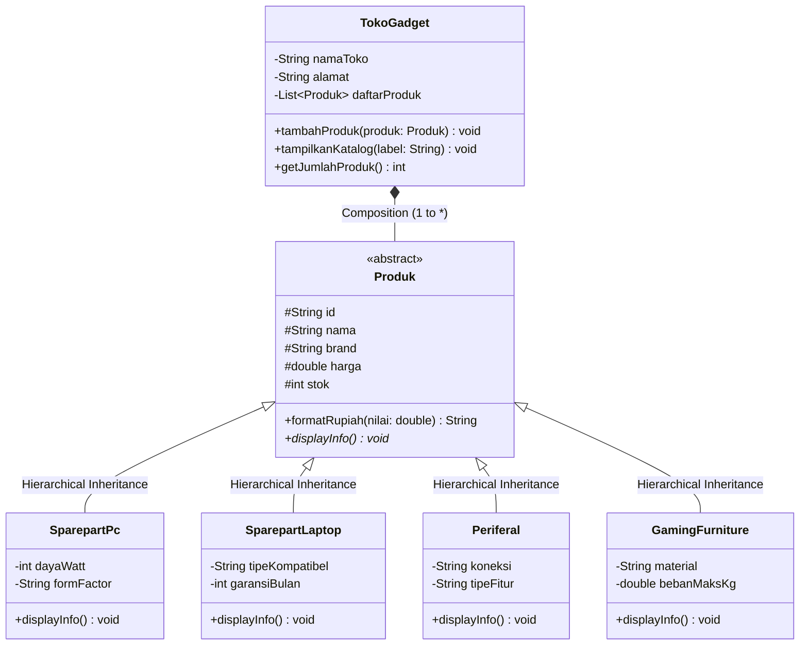
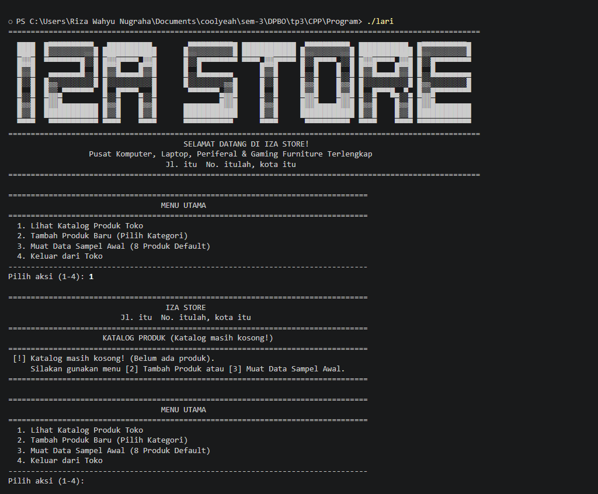
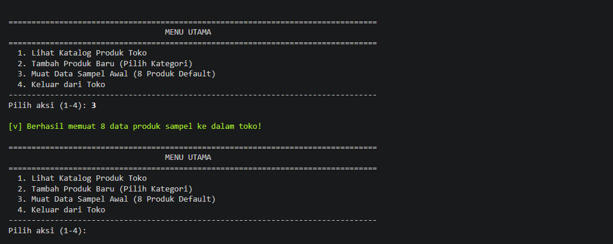
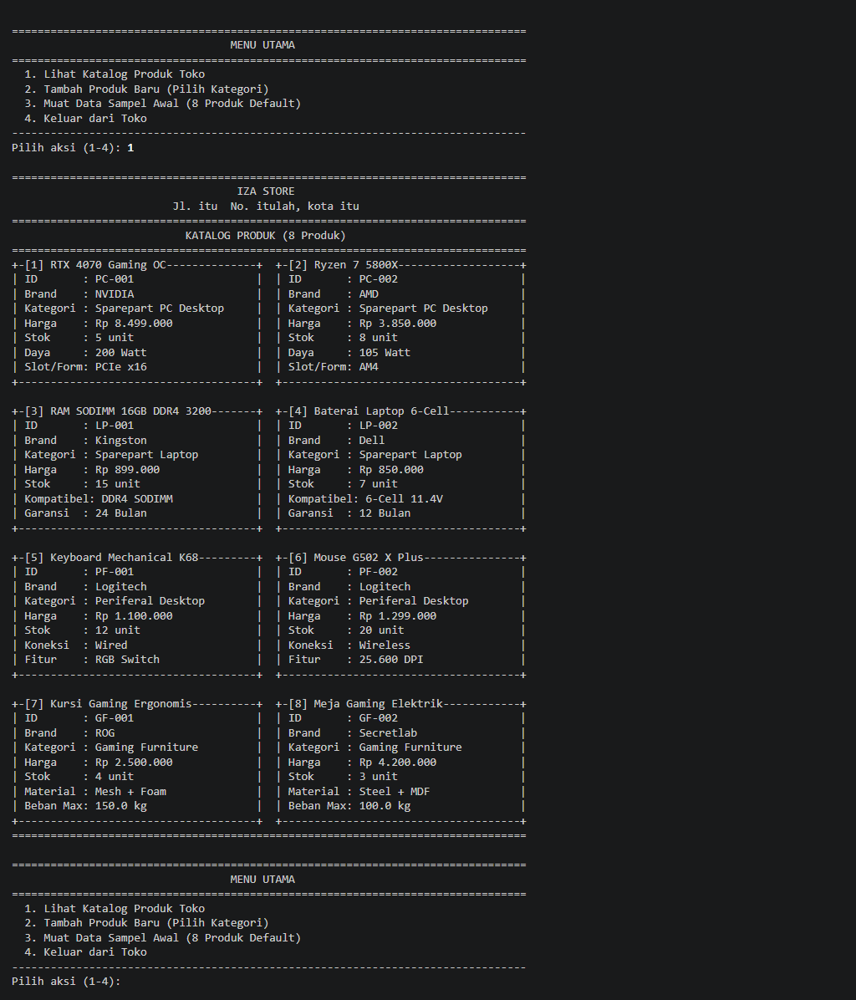
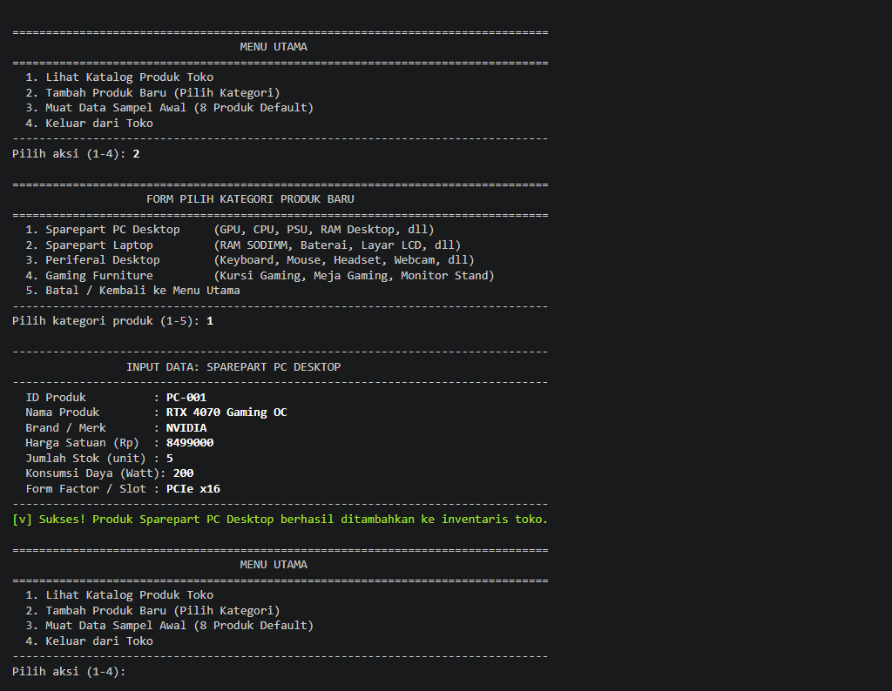
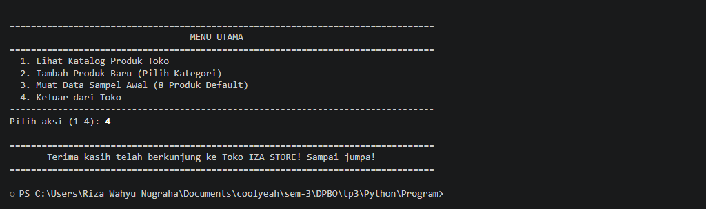
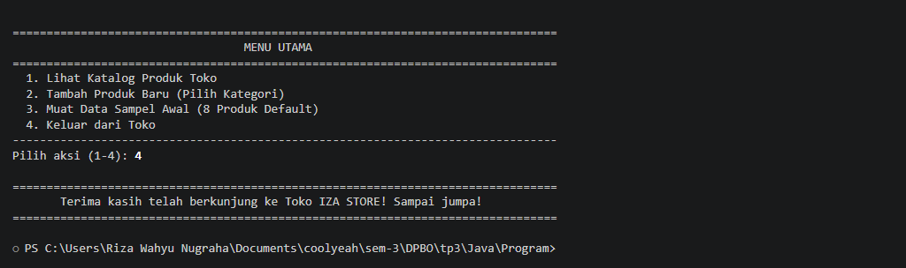

# TP3 DPBO 2026 – Inventori Toko "IZA STORE"

## Janji

Saya **Riza Wahyu Nugraha** dengan **NIM 2511421** mengerjakan **Tugas Praktikum 3** dalam mata kuliah **Desain dan Pemrograman Berorientasi Objek** untuk keberkahan-Nya maka saya tidak melakukan kecurangan seperti yang telah dispesifikasikan. Aamiin.

---

## Deskripsi Program

Program ini adalah sistem inventori katalog untuk toko **"IZA STORE"** yang berlokasi di **Jl. itu  No. itulah, kota itu**. Toko ini mengelola berbagai perlengkapan komputer dan ekosistem gaming yang terbagi ke dalam empat kategori utama:
1. **Sparepart PC Desktop** (Komponen seperti GPU, Processor, PSU).
2. **Sparepart Laptop** (Komponen khusus notebook seperti RAM SODIMM, Baterai).
3. **Periferal Desktop** (Peralatan input/output seperti Keyboard Mechanical, Mouse Gaming, Headset).
4. **Gaming Furniture** (Perabot setup gaming seperti Kursi Gaming Ergonomis, Meja Gaming Elektrik, Monitor Stand).

Sistem diimplementasikan secara identik pada tiga bahasa pemrograman berorientasi objek:
- **C++** (Menggunakan header `.h` dan implementasi `.cpp` modular, serta pointer polimorfik)
- **Python** (Menggunakan class modular dengan enkapsulasi private `__` dan `super()`)
- **Java** (Menggunakan *abstract class*, *inheritance*, dan *ArrayList*)

---

## Konsep OOP yang Diterapkan

1. **Hierarchical Inheritance (Pewarisan Hirarkis):**  
   Terdapat satu kelas induk (*superclass*), yaitu `Produk`, yang mewariskan atribut umum (`id`, `nama`, `brand`, `harga`, `stok`) serta perilaku `displayInfo()` kepada **empat kelas anak (*subclasses*)**:
   - `Produk` $\rightarrow$ `SparepartPc`
   - `Produk` $\rightarrow$ `SparepartLaptop`
   - `Produk` $\rightarrow$ `Periferal`
   - `Produk` $\rightarrow$ `GamingFurniture`

2. **Composition (Komposisi - Hubungan *Has-A*):**  
   Kelas `TokoGadget` memiliki (*has-a*) relasi kepemilikan kuat terhadap kumpulan `Produk`. Toko mengelola siklus hidup objek-objek produk di dalamnya. Pada C++, destructor `TokoGadget` secara bertanggung jawab membebaskan alokasi memori (*heap memory*) dari seluruh produk saat objek toko dihancurkan.

3. **Array of Objects:**  
   Katalog inventaris disimpan dalam bentuk struktur data dinamis kumpulan objek:
   - **C++:** `std::vector<Produk*>`
   - **Python:** `list` of `Produk`
   - **Java:** `ArrayList<Produk>`

4. **Pure Polymorphism (Polimorfisme Murni):**  
   Method `displayInfo()` dideklarasikan virtual/abstrak pada kelas `Produk` dan dioverride secara spesifik oleh masing-masing kelas turunan. Saat menampilkan katalog di dalam `TokoGadget`, iterasi hanya memanggil `produk->displayInfo()` tanpa adanya pengecekan tipe kondisi `if-else` atau `instanceof/type()`. Sistem runtime secara dinamis menentukan implementasi method yang sesuai (*dynamic dispatch*).

---

## Diagram Class

### Visualisasi Diagram (Mermaid)



### Representasi Teks (ASCII)

```text
                       +---------------------------------------+
                       |           <<abstract>>                |
                       |              Produk                   |
                       +---------------------------------------+
                       | # id       : String                   |
                       | # nama     : String                   |
                       | # brand    : String                   |
                       | # harga    : double                   |
                       | # stok     : int                      |
                       +---------------------------------------+
                       | + displayInfo()*                      |
                       +---------------------------------------+
                                          ^
                                          | (Hierarchical Inheritance)
          +-------------------+-----------+-----------+--------------------+
          |                   |                       |                    |
+-------------------+ +---------------------+ +------------------+ +-----------------------+
|    SparepartPc    | |   SparepartLaptop   | |    Periferal     | |    GamingFurniture    |
+-------------------+ +---------------------+ +------------------+ +-----------------------+
| - dayaWatt: int   | | - tipeKompatibel:str| | - koneksi: str   | | - material: str       |
| - formFactor: str | | - garansiBulan: int | | - tipeFitur: str | | - bebanMaksKg: double |
+-------------------+ +---------------------+ +------------------+ +-----------------------+
| + displayInfo()   | | + displayInfo()     | | + displayInfo()  | | + displayInfo()       |
+-------------------+ +---------------------+ +------------------+ +-----------------------+
          ^                   ^                       ^                    ^
          |                   |                       |                    |
          +-------------------+-----------+-----------+--------------------+
                                          *
                                          | (Composition: has-a)
                       +---------------------------------------+
                       |              TokoGadget               |
                       +---------------------------------------+
                       | - namaToko     : String               |
                       | - alamat       : String               |
                       | - daftarProduk : List<Produk*>        |
                       +---------------------------------------+
                       | + tambahProduk(Produk) : void         |
                       | + tampilkanKatalog(String) : void     |
                       | + getJumlahProduk() : int             |
                       +---------------------------------------+
```

---

## Tabel Atribut dan Methods

### 1. Tabel Atribut

| Kelas Pemilik | Nama Atribut | Tipe Data | Akses | Keterangan |
| :--- | :--- | :--- | :--- | :--- |
| **Produk** | `id` | String | Protected / Private | Kode unik identifikasi produk (contoh: `PC-001`, `LP-001`) |
| **Produk** | `nama` | String | Protected / Private | Nama lengkap produk |
| **Produk** | `brand` | String | Protected / Private | Merk manufaktur / pabrikan |
| **Produk** | `harga` | Double | Protected / Private | Harga jual satuan (Rupiah) |
| **Produk** | `stok` | Integer | Protected / Private | Ketersediaan kuantitas unit barang |
| **SparepartPc** | `dayaWatt` | Integer | Private | Estimasi konsumsi daya dalam satuan Watt |
| **SparepartPc** | `formFactor` | String | Private | Ukuran/soket dudukan (misal: `PCIe x16`, `AM4`, `ATX`) |
| **SparepartLaptop** | `tipeKompatibel`| String | Private | Tipe soket/modul kompatibilitas laptop (misal: `DDR4 SODIMM`) |
| **SparepartLaptop** | `garansiBulan` | Integer | Private | Masa garansi perlindungan resmi dalam bulan |
| **Periferal** | `koneksi` | String | Private | Jenis sambungan (misal: `Wired`, `Wireless`) |
| **Periferal** | `tipeFitur` | String | Private | Fitur utama penunjang (misal: `RGB Switch`, `25.600 DPI`) |
| **GamingFurniture** | `material` | String | Private | Bahan dasar pembuatan perabot |
| **GamingFurniture** | `bebanMaksKg` | Double | Private | Kapasitas beban maksimal dalam kilogram |
| **TokoGadget** | `namaToko` | String | Private | Nama identitas toko retail |
| **TokoGadget** | `alamat` | String | Private | Lokasi operasional toko |
| **TokoGadget** | `daftarProduk` | Array of Objects | Private | Koleksi/wadah list produk yang dijual di toko |

---

### 2. Tabel Methods

| Kelas | Nama Method | Return Type | Parameter | Keterangan |
| :--- | :--- | :--- | :--- | :--- |
| **Produk** | `Produk()` | Constructor | - | Menginisialisasi nilai default |
| **Produk** | `Produk(...)` | Constructor | `id`, `nama`, `brand`, `harga`, `stok` | Mengisi nilai atribut kelas induk |
| **Produk** | `getId()`, `setId()` | String / void | `id` (pada setter) | Getter dan setter kode ID produk |
| **Produk** | `getNama()`, `setNama()` | String / void | `nama` (pada setter) | Getter dan setter nama produk |
| **Produk** | `getBrand()`, `setBrand()`| String / void | `brand` (pada setter) | Getter dan setter merk produk |
| **Produk** | `getHarga()`, `setHarga()`| double / void | `harga` (pada setter) | Getter dan setter harga |
| **Produk** | `getStok()`, `setStok()` | int / void | `stok` (pada setter) | Getter dan setter kuantitas stok |
| **Produk** | `formatRupiah()` | String | `nilai: double` | Helper pemformat nominal angka ke format Rupiah |
| **Produk** | `displayInfo()` | void (abstract) | - | Blueprint method penampilan data (wajib di-override) |
| **SparepartPc** | `displayInfo()` | void | - | Override: menampilkan identitas produk + daya & form factor |
| **SparepartLaptop**| `displayInfo()` | void | - | Override: menampilkan identitas produk + kompatibilitas & garansi |
| **Periferal** | `displayInfo()` | void | - | Override: menampilkan identitas produk + jenis koneksi & fitur |
| **GamingFurniture**| `displayInfo()` | void | - | Override: menampilkan identitas produk + bahan & beban maksimal |
| **TokoGadget** | `TokoGadget(...)` | Constructor | `namaToko`, `alamat` | Menginisialisasi toko dan alokasi array inventaris |
| **TokoGadget** | `tambahProduk()` | void | `Produk*` / `Produk` | Menambahkan item baru ke dalam koleksi inventaris |
| **TokoGadget** | `tampilkanKatalog()` | void | `label: String` | Mencetak header toko dan mendaftar seluruh produk via polimorfisme |
| **TokoGadget** | `getJumlahProduk()` | int | - | Mengembalikan banyaknya produk aktif yang terdata |

---

## Penjelasan Alur Program dan UX Interaktif

Program ini mengusung antarmuka terminal interaktif (*interactive CLI UX*) layaknya sistem kasir/manajemen toko retail sungguhan:

1. **Welcoming Entrance:**  
   Saat pertama kali dijalankan, program menampilkan banner selamat datang megah bertuliskan ASCII Art **IZA STORE** beserta informasi alamat toko di Bandung.
2. **Menu Utama Interaktif:**  
   Pengguna disajikan 4 menu pilihan:
   - `[1] Lihat Katalog Produk Toko`: Menampilkan katalog produk secara polimorfik dengan format **2 kartu berjejer ke samping (*2-column side-by-side card grid*)** yang estetik dan hemat ruang (pas pada standar 80 kolom terminal). Jika inventaris masih kosong, sistem menginformasikan status bahwa katalog masih kosong (0 produk). Jika sudah terisi, sistem menampilkan counter jumlah produk secara dinamis (contoh: `KATALOG PRODUK (1 Produk)` atau `KATALOG PRODUK (8 Produk)`).
   - `[2] Tambah Produk Baru (Pilih Kategori)`: Membuka sub-menu pemilihan kategori dengan form input yang disesuaikan (*customized layout*).
   - `[3] Muat Data Sampel Awal (8 Produk Default)`: Memuat 8 data sampel secara instan untuk kemudahan pengujian/demo.
   - `[4] Keluar dari Toko`: Menutup program dengan pesan terima kasih ramah dari IZA STORE.
3. **Pemisahan Form Input Berdasarkan Kategori:**  
   Layout formulir dipisahkan secara dinamis sesuai kebutuhan atribut spesifik masing-masing kelas:
   - **Sparepart PC Desktop:** Input atribut umum + Konsumsi Daya (W) & Form Factor/Slot.
   - **Sparepart Laptop:** Input atribut umum + Kompatibilitas Soket/Tipe & Garansi Resmi (Bulan).
   - **Periferal Desktop:** Input atribut umum + Tipe Konektivitas & Fitur Unggulan.
   - **Gaming Furniture:** Input atribut umum + Bahan/Material & Beban Maksimal (Kg).
4. **Tampilan Kartu Polimorfik 2 Kolom:**  
   Katalog produk ditampilkan berjejer 2 kotak ke samping menggunakan pemanggilan method polimorfik murni, menampilkan ID, Kategori, Nama Produk, Brand, Harga (format Rupiah), Stok, serta dua baris spesifikasi unik tiap subclass secara rapi dan presisi.

---

## Panduan Kompilasi dan Eksekusi

### 1. C++
Masuk ke direktori program C++:
```bash
cd tp3/CPP/Program
g++ main.cpp -o main.exe
./main.exe
```

### 2. Python
Masuk ke direktori program Python:
```bash
cd tp3/Python/Program
python main.py
```

### 3. Java
Masuk ke direktori program Java:
```bash
cd tp3/Java/Program
javac *.java
java Main
```

---

## Dokumentasi

Screenshot dibuat dari program yang dijalankan pada terminal Windows (PowerShell). Pada setiap bahasa pemrograman (C++, Python, dan Java), tangkapan layar terminal mendokumentasikan lima tahapan interaksi menu toko secara komprehensif:
1. **Lihat Katalog (Saat Masih Kosong):** Menampilkan banner welcoming megah ASCII art IZA STORE dan status bahwa katalog toko masih kosong (0 produk).
2. **Tambah Produk Baru:** Formulir input data dinamis berdasarkan kategori yang dipilih beserta konfirmasi sukses penyimpanan objek produk.
3. **Muat Data Sampel Awal:** Pengisian 8 produk sampel default secara otomatis ke dalam inventaris toko.
4. **Lihat Katalog (Setelah Berisi Item):** Tampilan visual kartu katalog produk secara polimorfik murni dengan format **grid 2 kolom berjejer ke samping (*2-column side-by-side card grid*)**.
5. **Keluar dari Toko:** Menutup program dengan pesan perpisahan ramah dari IZA STORE.

---

### C++

#### 1. Lihat Katalog (Saat Masih Kosong)



[Buka screenshot C++ katalog kosong](Dokumentasi/cpp_01_katalog_kosong.png).

#### 2. Tambah Produk Baru


[Buka screenshot C++ tambah produk baru](Dokumentasi/cpp_02_tambah_produk.png).

#### 3. Muat Data Sampel Awal



[Buka screenshot C++ muat data sampel](Dokumentasi/cpp_03_muat_data.png).

#### 4. Lihat Katalog (Setelah Berisi Item - Grid 2 Kolom)



[Buka screenshot C++ katalog berisi item](Dokumentasi/cpp_04_katalog_berisi.png).

#### 5. Keluar dari Toko


[Buka screenshot C++ keluar dari toko](Dokumentasi/cpp_05_keluar.png).

---

### Python

#### 1. Lihat Katalog (Saat Masih Kosong)


[Buka screenshot Python katalog kosong](Dokumentasi/python_01_katalog_kosong.png).

#### 2. Tambah Produk Baru



[Buka screenshot Python tambah produk baru](Dokumentasi/python_02_tambah_produk.png).

#### 3. Muat Data Sampel Awal


[Buka screenshot Python muat data sampel](Dokumentasi/python_03_muat_data.png).

#### 4. Lihat Katalog (Setelah Berisi Item - Grid 2 Kolom)


[Buka screenshot Python katalog berisi item](Dokumentasi/python_04_katalog_berisi.png).

#### 5. Keluar dari Toko



[Buka screenshot Python keluar dari toko](Dokumentasi/python_05_keluar.png).

---

### Java

#### 1. Lihat Katalog (Saat Masih Kosong)


[Buka screenshot Java katalog kosong](Dokumentasi/java_01_katalog_kosong.png).

#### 2. Tambah Produk Baru


[Buka screenshot Java tambah produk baru](Dokumentasi/java_02_tambah_produk.png).

#### 3. Muat Data Sampel Awal


[Buka screenshot Java muat data sampel](Dokumentasi/java_03_muat_data.png).

#### 4. Lihat Katalog (Setelah Berisi Item - Grid 2 Kolom)


[Buka screenshot Java katalog berisi item](Dokumentasi/java_04_katalog_berisi.png).

#### 5. Keluar dari Toko



[Buka screenshot Java keluar dari toko](Dokumentasi/java_05_keluar.png).

